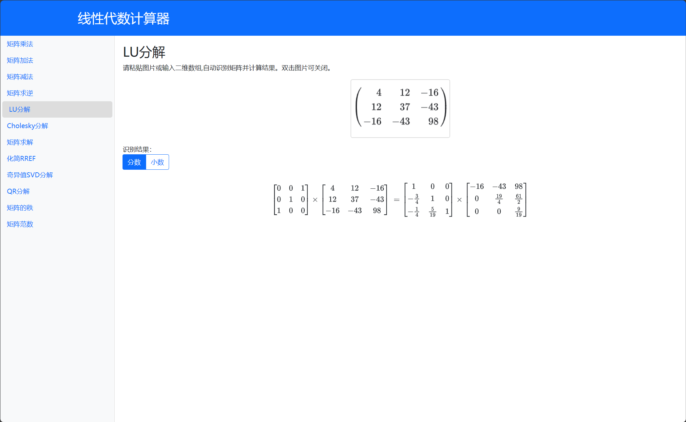

# 🔧 线性代数计算器



## 🚀 介绍

线性代数计算器是一个在线计算器，可以计算矩阵的行列式、逆矩阵、秩、特征值、特征向量、矩阵乘法等。

**完全免费开放**

## 💻 使用方法

### 自动识别

1. 截图需要计算的矩阵
2. 选择想要使用的计算方法
3. 粘贴截图

### 手动输入

1. 输入矩阵
    
    eg. 
    ```
    1 2 3
    4 5 6
    7 8 9
    ```
    ```
    1, 2, 3
    4, 5, 6
    7, 8, 9
    ```

2. 选择想要使用的计算方法后自动计算

## 💡 贡献

欢迎提交 PR 和 Issue。

如果你有想法或需求，可以在 Issue 中提出。

也可以检查计算的结果是否有误！

如果你想为项目贡献代码，请在 PR 前创建 Issue。